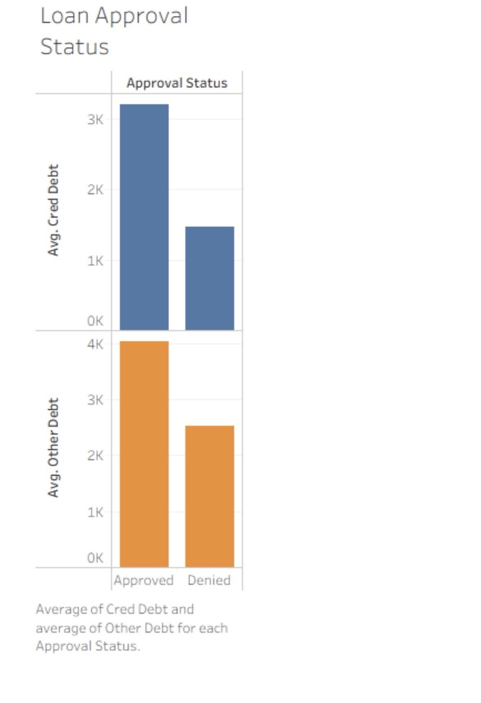

# Loan Approval Status Analysis

## Business Problem
Speedy Loans management wanted to understand what distinguishes approved from denied loan applicants, specifically looking at credit card debt and other debt levels.

## My Approach
- Used Tableau calculated fields to transform binary loan status (0/1) into readable categories ("Approved"/"Denied")
- Created bar charts comparing average credit card debt and average other debt across approval statuses
- Changed measures from SUM to AVERAGE for accurate comparison

## Key Findings
| Approval Status | Average Other Debt | Insight |
| :--- | :--- | :--- |
| **Approved** | ~R4,036 | Lower other debt |
| **Denied** | Very high | Other debt is a dominant denial factor |

- **Credit card debt** is similar between both groups
- **Other debt** is the key differentiator — high levels strongly correlate with denial
- Applicants with high other debt are viewed as higher risk borrowers with limited capacity for additional monthly payments

## Business Recommendations
1. **Other debt** should be a primary screening criterion in loan decisions
2. Applicants with high other debt may need debt consolidation options before approval
3. Credit card debt alone is not a strong predictor of loan approval

## Technologies Used
- Tableau (Calculated fields, Bar charts, Dual-axis comparison)

## 📊 Visualization

